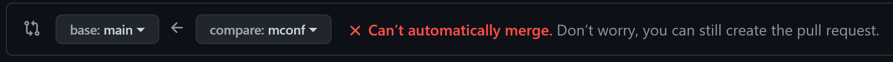
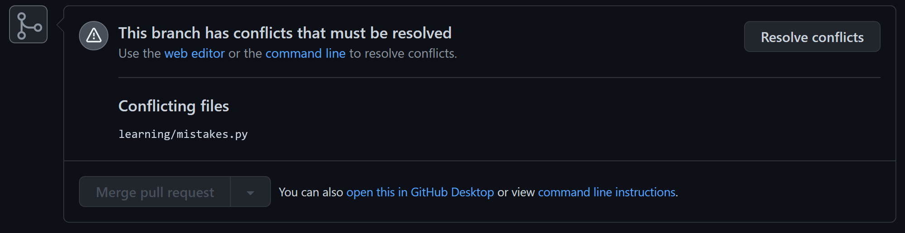
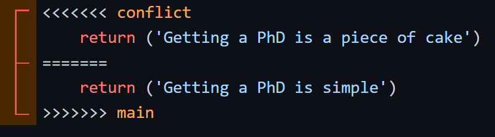
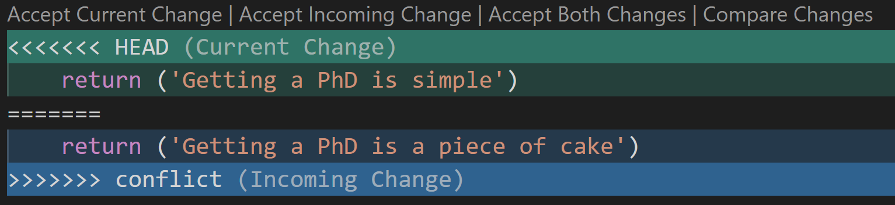

# Moderate Tutorials
#### Sections
- [Git commands](#git-commands)
- [Merge conflicts](#merge-conflicts)
- [Formatting code](#formatting-code)
- [Versioning](#versioning)
- [Referencing](#referencing)
- [Multiple remotes](#multiple-remotes)
---
## Git Commands
By now, you can probably look into Git commands on your own. Some useful commands to get familiar with include
```bash
$ git cherry-pick   # quite easy to use in VSC
$ git reset
$ git rebase
$ git tag
```
---
## Merge Conflicts
Merging and conflicts are a common part of the Git experience. Conflicts generally arise when two people have changed the same lines in a file, or if the same file was modified on both branches involved in the merge. Luckily, resolving a merge conflict is often straightforward. Let's get familiar with solving merge conflicts by purposefully creating a conflict in this next section, and solving it three different ways.
1. Checkout a new branch from the `main` branch and name it `conflict`
0. In VSC, open the [`learning/mistakes.py`](./learning/mistakes.py) file and edit line 6
    ```python
    return ('Getting a PhD is easy')
    # update to say 
    return ('Getting a PhD is a piece of cake')
    ```
    - Add, commit, and push this change to the `conflict` branch. Perhaps the message is `bad joke`
0. Checkout `main` and edit the same line
    ```python
    return ('Getting a PhD is simple')
    ```
    - Add, commit, and push to `main`. Perhaps this message is `terrible joke`
0. In GitHub, open a PR `main <-- conflict`
    - You'll get a warning of the merge conflict. Create the PR anyway

        
        
    - Click on **Resolve conflicts** and you'll enter the GitHub editor. On the top, we have the incoming change from `conflict`, and below the `======` we have the current change from `main`

        
    - To resolve, simply pick one version, or a combination of the two, and delete the extra lines. To finish, click **Mark as resolved** and then **Merge**
    - Back in the PR, you can see there is a new merge commit that resolves the conflict
0. Close the PR without merging the PR. Now we want to undo all our merge work and try again another way
    - Checkout the `conflict` branch and take a look at the git log or git graph in VSC
    - Run `git fetch` to update the origin remote. You'll see the merge commit on `origin/conflict`, while your local `conflict` branch is behind `origin`
    - Run `git push -f` to force push your local code and overwrite the merge commit on `origin` 
    - **Alternatively**, if you pulled down the merge commit from `origin` to your local machine (meaning your last commit is a merge commit, combining the two branch histories), we can undo it and then force push
        ```bash
        $ git reset --merge HEAD~1
        $ git push -f
        ```
        - `git reset` can be dangerous, and I do not recommend it's use in general unless you fully understand what it does. It can be especially confusing for code that is worked on by multiple developers, as its use is untraceable (unlike `git revert`). Learn more by reading the [docs](https://git-scm.com/docs/git-reset)
        - `HEAD` refers to the current state of your repository, and `HEAD~1` is the last commit in your repository. Similarly `HEAD~2` is the second to last commit.
0. Now, let's manage a merge conflict with VSC
    - Merge `conflict` into `main`
        ```bash
        $ git checkout main
        $ git merge conflict
        > Auto-merging learning/mistakes.py
        > CONFLICT (content): Merge conflict in learning/mistakes.py
        > Automatic merge failed; fix conflicts and then commit the result.
        ```
    - In VSC, the **Source Control** tab shows our file under "Merge Changes" with a "C" for "Conflict." Clicking on it to view the conflict, we see

        
    - We can manually edit like before, or click one of the options at the top of the merge conflict. `Accept Current Change` will save `Getting a PhD is simple` and discard the rest. You can explore the other options.
    - You can save your changes, edit the commit message in VSC if desired, and commit the merge by clicking the check mark. *But don't click just yet!*
0. Let's see if we can fix this entirely in Git
    - We will use VIM for this, so it will be useful to know some [basic commands](https://www.radford.edu/~mhtay/CPSC120/VIM_Editor_Commands.htm)
        - Type `vim learning/mistakes.py` to open the file with VIM and see the merge conflict
        - Use the arrow keys to move the curser around
        - Type `i` to switch to "insert" mode
        - Hit `Esc key` to switch back to command mode
        - Type `:wq` to write your changes (save) and quit VIM
    - Back in Git
        ```bash
        $ git status    # optional
        $ git add .
        $ git status    # optional
        $ git commit    # note I left off the -m 'message' part
        # There is a default merge commit message in place
        # Edit it with VIM commands and :wq
        # Or just accept the default and :q
        $ git push      # to finally push the merge changes to master
        ```    
---
## Formatting Code
Code formatting is important for code readability. As you code over time, and especially when you develop with multiple people, a code formatter will make it simple to keep consistent formatting across all your documents. Personally, I like [YAPF](https://pypi.org/project/yapf/) (yet another python formatter). The "knob settings" I use can be found in the [`.style.yapf`](./.style.yapf) file.

1. Install yapf
    - Type ``Ctrl + ` `` (thats the backtick character) to open the terminal in VSC
    - In the terminal, type `pip install yapf`
    - Close the terminal and open [`learning/mistakes.py`](./learning/mistakes.py)
0. Run the formatter
    - Type `Shift + Alt + F` to run the formatter
        - Alternatively type `Ctrl + Shift + P` to bring up the command palette, and search for "Format Document"
    - Notice which lines change and how the formatter makes the document easier to read.
0. You can obviously find many more examples online, and I encourage you to play around with the "knob settings" to get a sense of what each one does.

---
## Versioning
When code is released publicly, developers use version numbers to keep things straight. It marks a snapshot in time, and allows users to call a frozen version of the code. Once a version is released, it NEVER change, and the results are always the same. However, new versions can always be created, and they supersede old releases.

For questions regarding versioning, refer to this guide on [Semantic Versioning](https://semver.org/). Here's a quick cheat sheet for how our lab operates (note: `devN` releases are rare)

- MAJOR.MINOR.PATCH[.DEV] or `X.Y.Z[.devN]` will be the version style used
    - MAJOR version zero `0.y.z` is for initial development. Anything MAY change at any time
    - MAJOR version X `X.y.z` MUST be incremented if any backwards incompatible changes are introduced
    - MINOR version Y `x.Y.z` MUST be incremented if new, backwards compatible functionality is introduced
    - PATCH version Z `x.y.Z` MUST be incremented if only backwards compatible bug fixes are introduced
    - In early development, it MAY be desireable to provide API access to a developmental release `x.y.z.devN`
        - Dev versions are superseded by full releases of the same number. For example
        ```
        0.1.0 --> 0.2.0.dev0 --> 0.2.0.dev1 --> 0.2.0 --> 0.2.1
        ``` 

Version releases are achieved by the use of "tags." Tags can be created in GitHub, or with the `git tag` command. I'll leave it to you to explore more on this front.
- Note that once tags are created, we can reference them quite easily. Similar to how we can reference PRs, Issues, and individual commit hashes.

---
## Referencing
A great feature about Git and GitHub is that we can reference specific commits, tags, PRs, and issues.

#### Referencing Commits
To reference a commit, simply type its unique SHA-hash and it will automatically get turned into a link. In fact, you don't need to type the entire 40-character hash, just enough characters to uniquely identify it. I recommend **8 characters** (GitHub requires at least 7, VSC requires at least 6). There is a good conversation on this topic on [Stack Overflow](https://stackoverflow.com/questions/18134627/how-much-of-a-git-sha-is-generally-considered-necessary-to-uniquely-identify-a).

*Examples*
- Commit message: `important message that references commit 57f3e830`
- PR/Issue comment: `Look into 57f3e830`

#### Referencing PRs/Issues
PRs and Issues are a GitHub feature. They are tracked together by one set of incrementing numbers. To reference them, type `#` and the appropriate number. Simply typing `#1` is enough to reference PR/issue #1 in GitHub.
- In GitHub, a handy dropdown will help you link a specific PR/issue
- In VSC, you will see a dropdown after typing `#` in a commit message. VSC will insert the PR/Issue title and number. Be aware that the title is unnecessary for the link. Further, VSC will not show links to PRs/Issues in commit messages in general (this is a GitHub feature)
- It all works the same in Git, just no helpful dropdown menu
- The GitHub extension in VSC enables one *awesome* feature, which is issue creation/linking via code comments. Within a comment, typing `#1` will link to issue #1 in VSC (not in GitHub). We also covered how to create issues from `# TODO` tags in the [beginner module](./beginner.md#practice)
- Note, referrals will show up as comments inside the referenced PR/Issue

*Examples*
- Commit message: `important message that references PR/issue #1`
- PR/Issue comment: `Look into #1`
- Code comment: `# python comment addressed in #1` VSC will link these references to issues via the GitHub extension
- You can also create a new issue straight from a PR/issue comment you want to reference: [read more](https://docs.github.com/en/github/managing-your-work-on-github/opening-an-issue-from-a-comment)

---
## Multiple remotes
Git allows local repositories to track multiple remotes (i.e. multiple separate repositories). Learn more from the [docs](https://git-scm.com/docs/git-remote). 
- Typically, we would want to do this to track a forked repo *and* its parent. This allows us to directly apply changes or updates to the parent repo to our forked repo. In this case, the two repositories have a common history, so merging changes is straightforward. Just like merging branches in the same repo, you will occasionally have merge conflicts, but they are also generally easy to resolve. 
- In rare cases, it may be useful to track repos with unrelated histories. In this case, merging is more complex and requires more manual work.

#### Track a fork and its parent
1. Fork this repo and setup a local copy on your machine. If you need help setting up this initial structure, see the [beginner module](./beginner.md#setup-your-training-repo).
0. Verify the existing remotes
    ```bash
    $ git remote -v
    > origin https://github.com/<username>/training.git (fetch)
    > origin https://github.com/<username>/training.git (push)
    ```
    - Here, there is one remote, named `origin`, located at the indicated URL (your forked repo). We can also see where the commands `git fetch` and `git push` point (recall `git pull` is running `git fetch` first).
0. Add a new remote to track your fork's parent repo and verify
    ```bash
    $ git remote add upstream https://github.com/djmcgregor/training.git
    #                ^ name of new remote
    
    $ git remove -v
    > origin    https://github.com/<username>/training.git (fetch)
    > origin    https://github.com/<username>/training.git (push)
    > upstream  https://github.com/djmcgregor/training.git (fetch)
    > upstream  https://github.com/djmcgregor/training.git (push)
    ```
    - We now have two remotes, `origin` and `upstream`, that track two different GitHub repos
    - It is common to use `upstream` as the remote name for fork parent repos, but you can name it whatever you want. Just don't overwrite `origin` unless you know what you are doing
0. Access the `upstream` remote
    - `git fetch/push` defaults to `origin`, but we can access the `upstream` remote by explicitly pointing to it
    ```bash
    git fetch upstream
    ```
0. Apply changes from `upstream` to `origin`
    - Let's assume there are changes made to the parent repo that is being tracked by `upstream`
    - Make a new branch, and pull changes from the `upstream/main` (or other) branch
    ```bash
    git checkout -b parent_changes
    
    git pull upstream/main
    # OR
    git fetch upstream      # fetches all updates
    git merge upstream/main
    ```
    - Solve any merge conflicts
    - PR or merge branch into `main`
    ```bash
    git checkout main
    git merge parent_changes
    ```

#### Track unrelated repos
One case where this may be desired is to combine two separate repos. In this case, each repo has it's own unique history with commits, PRs, Issues, etc. To combine them, we will need to sacrifice the PR/Issue history from at least one of the repos. If this is undesirable, there may be alternatives such as git subtree or packaging. Both are explored further in the [advanced module](.advanced.md#). Also see a good discussion on [Stack Overflow](https://stackoverflow.com/questions/1425892/how-do-you-merge-two-git-repositories)
1. Within `project-a`, create a new branch off `main`, and add a remote to `project-b`
    ```bash
    git checkout -b b_work
    git remote add -f project-b <path/to/project-b>
    #               ^ immediately fetches remote
    git merge --allow-unrelated-histories project-b/main    # or whatever branch you want
    git remote remove project-b
    ```
    - If you want to keep tags from `project-b`, consider fetching the remote with the `--tags` option
    ```bash
    git fetch project-b --tags
    ```
0. Cleanup time
    - This effectively superimposes the `project-b` repo history on top of the `project-a` history. Watch out for identically named files or tags
    - Note: Commits that reference PRs/Issues will retain the number, but the link will disappear. I am unsure if they will create a new link once a matching PR/Issue is created.
    - Note: Importing `project-b` tags whose names are identical to native tags in `project-a` will fail silently. The tags will simply be dropped from the import list, and the `project-a` tags will remain.
